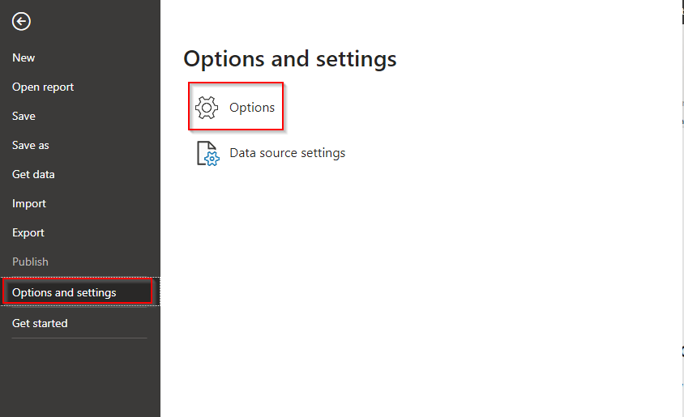
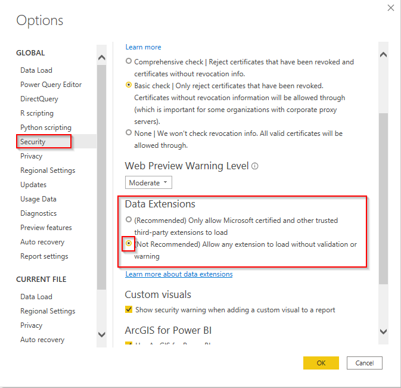
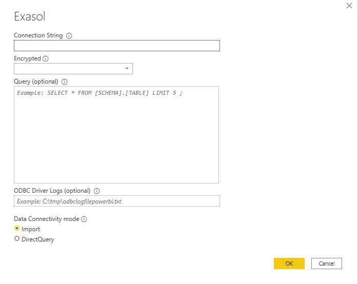
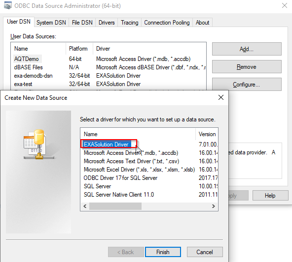
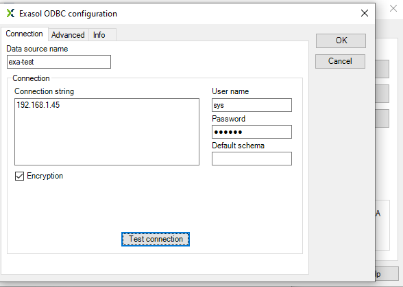
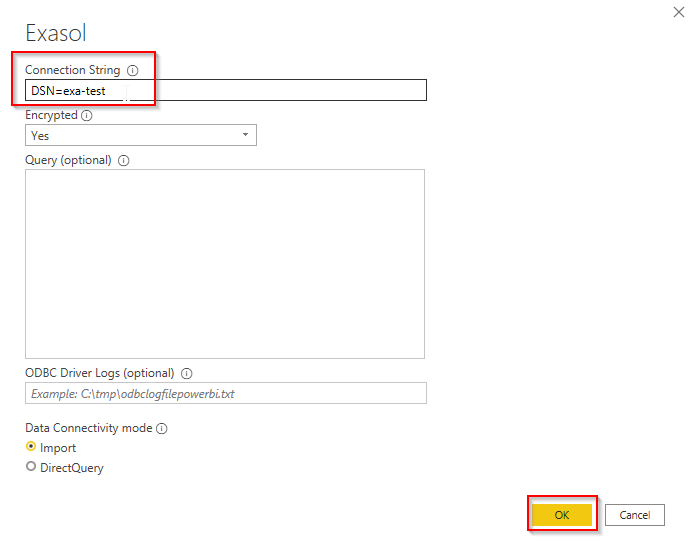
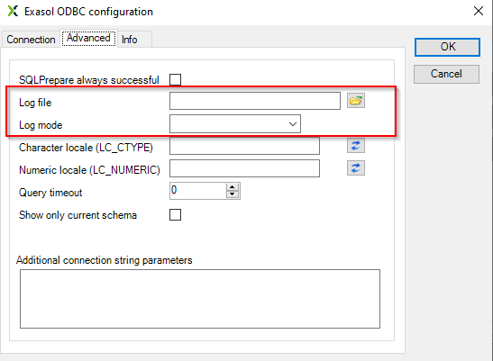
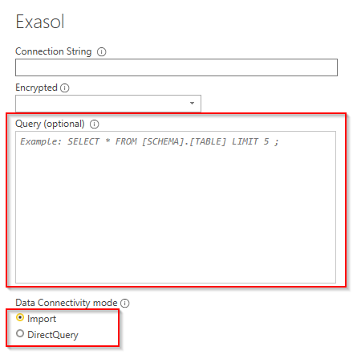

# Exasol Power BI Connector 1.0.7 Release - User Guide

## New features

- Custom Query support

- ODBC Driver Logging

- DSN (Data Source Name) Support

- Limited Kerberos support

## Installing the connector:

### Download the .mez

Copy the ''Exasol.mez' file available on : [Releases · exasol/powerbi-exasol · GitHub](https://github.com/exasol/powerbi-exasol/releases)

You can find it separately under the assets dropdown.

This is the direct link:

https://github.com/exasol/powerbi-exasol/releases/download/1.0.7/Exasol.mez

### Copy the .mez to the following directory

Copy the mez file to `C:\Users\\<YourAccount>\Documents\Microsoft Power BI Desktop\Custom Connectors` Directory. 

Create the directory path if it doesn't exist.

### Change the PowerBI Desktop settings

Go to options in PowerBI:

File > Options and settings > Options

Navigate to the security tab.

Change the data extensions setting to allow the custom connector to load.

### Shut down and restart Power BI Desktop

You'll need to reload PowerBI for these changes to have an effect (and the new connector version to load in).

## Using the connector and its new features

After installing the connector following the steps above you'll automatically use this connector when you go to Get Datasource > Get Exasol.

The connector should be backwards compatible in that it shouldn't break your existing reports.

As you will see the connector now looks slightly different:

(Brief instructions on these new features follow below)

## DSN (Data Source Name) Support

Next to connection strings the new version of the connector now also supports Data Source Names (DSNs). 

This way you can also use preconfigured data sources.

There are many applications of this feature ( e.g: logging, debugging, advanced authentication scenarios. )

### Creating a datasource

You can create and edit datasources in the 'ODBC Data sources' app available on Windows

Let's look at a simple example:

Let's create a simple data source

Let's call it "exa-test" and use the simplest connection string we can

(You have an option to test the connection here to make sure it works. You might need to provide credentials but you can remove these after the test if you wish.) 

### Using the data source name in the connector

Write DSN=<your-data-source-name> as the connection string and press OK.

Depending on whether you've provided credentials or not in your connection string you then pick one of the available authentication options and you should be succesfully connected.

#### Use case: ODBC Driver Logs

You can easily enable and disable ODBC driver logging using the data source options:

Navigate to the 'ODBC data sources' application.

Select your data source, click the "advanced" tab.

You can easily turn logging on and off as well as select a desired log mode using the "Log file and "Log mode" fields.

Another option to do this is to manually add the relevant connection string keys to the connection string or to add them to Additional Connection string parameters under 'Advanced'.

In this case that would be: LOGMODE=DEBUGCOMM;EXALOGFILE=C:\tmp\pbiblog.txt;

#### Use case: Advanced Kerberos scenarios

In case the default built in Kerberos option isn't enough you can use a DSN and append KERBEROSHOSTNAME and KERBEROSSERVICENAME connection string keys and values to the connectionstring.

#### More information

There is also more documentation on exasol ODBC datasources configuration available here: [ODBC Driver for Windows | Exasol Documentation](https://docs.exasol.com/connect_exasol/drivers/odbc/odbc_windows.htm)

For an overview of the other available connection string keys, see this article:

[Using the ODBC Driver | Exasol Documentation](https://docs.exasol.com/connect_exasol/drivers/odbc/using_odbc.htm)

# Custom Query support

It is now possible to write a custom query to fetch results.

You can alter this query afterwards in the Power Query editor as well.

Important note: You can only use a custom query in "import" mode. You can also use DirectQuery but won't be able to use the results in any visuals. 

(You can alter the mode afterwards in the model screen in case you accidentally picked the unsupported option.)

# Limited Kerberos support

We also support an 'easy' kerberos authentication mode where the KERBEROSSERVICENAME will be exasol/<dnsrecord> if you choose the kerberos authentication option.

If you need more control over this you can set the right values in the data source connection string instead (see data sources section above) and then opt for kerberos (if you use a DSN this will add no additional authentication connection string keys) or 'implicit' authentication.
